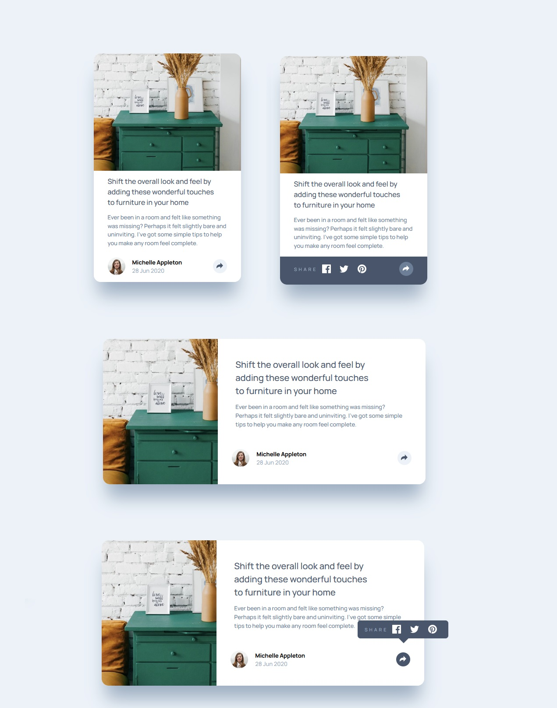

<!-- # Frontend Mentor - Article preview component solution

This is a solution to the [Article preview component challenge on Frontend Mentor](https://www.frontendmentor.io/challenges/article-preview-component-dYBN_pYFT). -->

## Table of contents

- [Overview](#overview)
  - [The challenge](#the-challenge)
  - [Screenshot](#screenshot)
  - [Links](#links)
- [My process](#my-process)
  - [Built with](#built-with)
  - [What I learned](#what-i-learned)
  - [Continued development](#continued-development)
  - [Useful resources](#useful-resources)
- [Author](#author)
- [Acknowledgments](#acknowledgments)

## Overview

### The challenge

Users should be able to:

- View the optimal layout for the component depending on their device's screen size
- See the social media share links when they click the share icon

### Screenshot

### Links

- Solution URL: [Github](https://github.com/i-prkr/article-preview)
- Live Site URL: [Github Pages](https://your-live-site-url.com)

## My process

### Built with

- Semantic HTML5 markup
- SCSS
- BEM
- Mobile-first workflow
- Vercel

### What I learned

### Continued development

### Useful resources

- [Example resource 1](https://www.example.com) - This helped me for XYZ reason. I really liked this pattern and will use it going forward.
- [Example resource 2](https://www.example.com) - This is an amazing article which helped me finally understand XYZ. I'd recommend it to anyone still learning this concept.

## Author

- Frontend Mentor - [@i-prkr](https://www.frontendmentor.io/profile/i-prkr)
- Github - [Github](https://github.com/i-prkr)

## Acknowledgments
